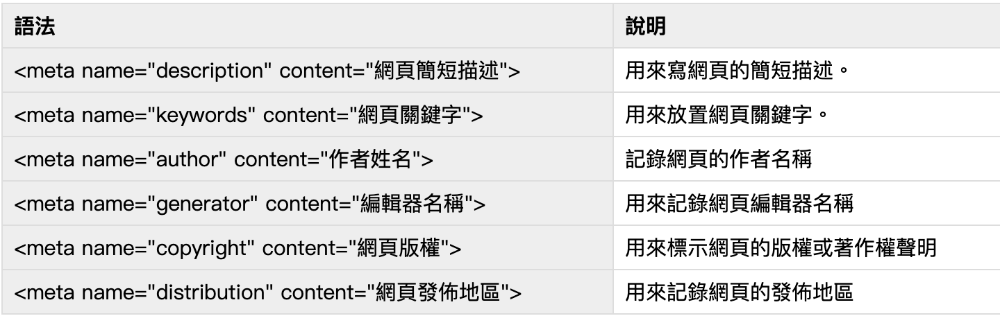
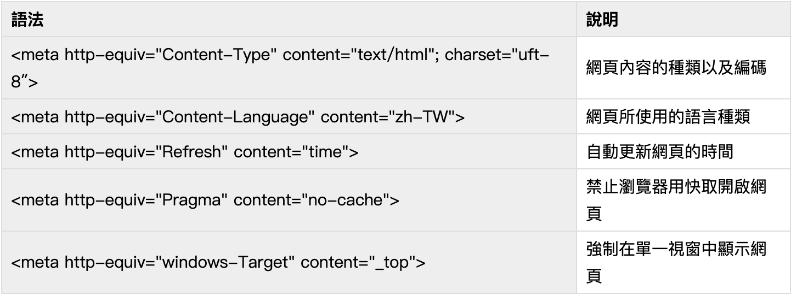

# meda標籤
1. 用以提供網頁內容資訊給**瀏覽器**或**搜尋引擎**
2. 例如關鍵字,編碼等
3. 也可以包含一謝非必要資訊(作者,時間...)
## 規範
1. 需全部位於`<head>`內
2. 不需結尾,全部內容包含在一個`<meta>`內
3. 兩大類`name`與`http-equiv`
## name類
1. 用於標註非格式資訊
2. 格式為name搭配content
3. 常用meta

## http-equiv類
1. 用於標注網頁格式
2. 格式為http-equiv搭配content
3. 常用meta

## Html5新增meta
1. `<meta charset='UTF-8'>`-設定網頁編碼為`UTF-8`(萬國編碼)
